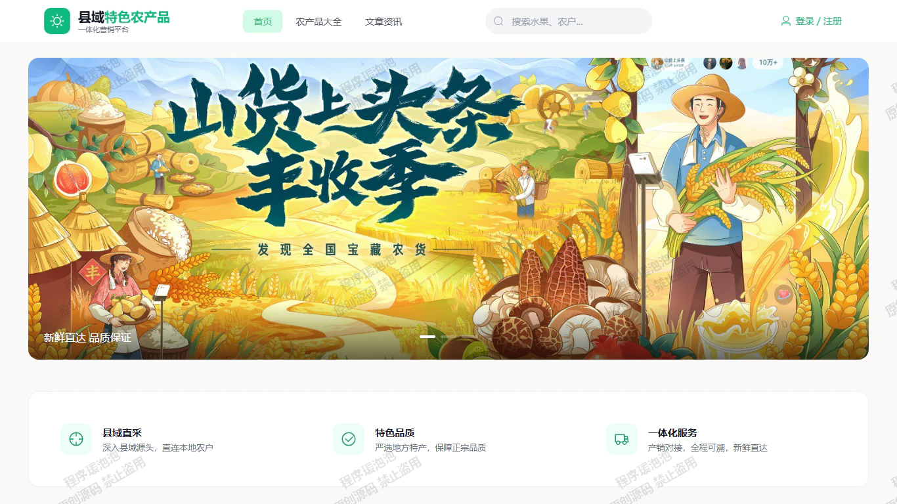
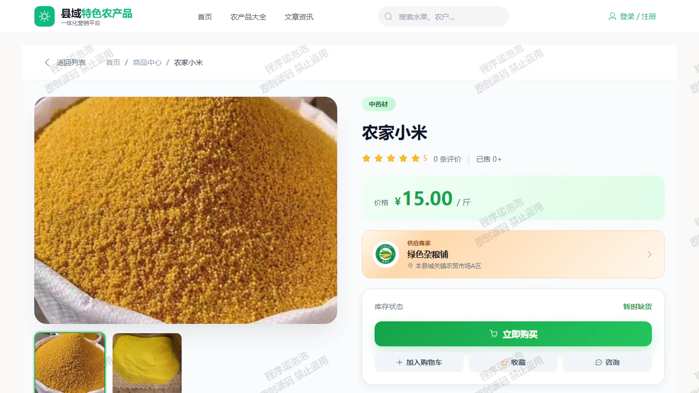
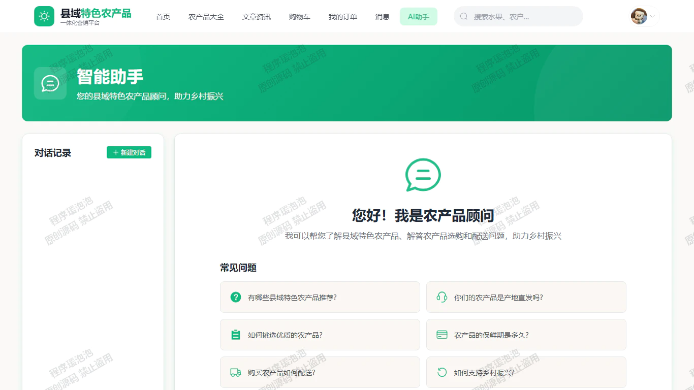
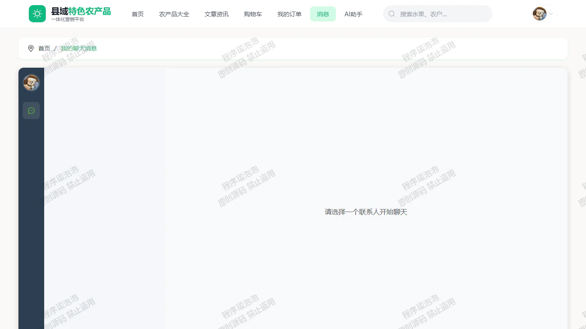
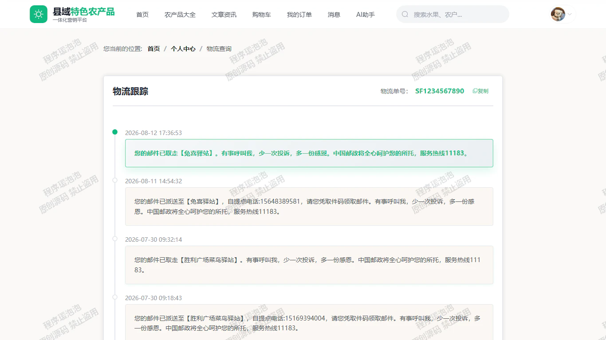
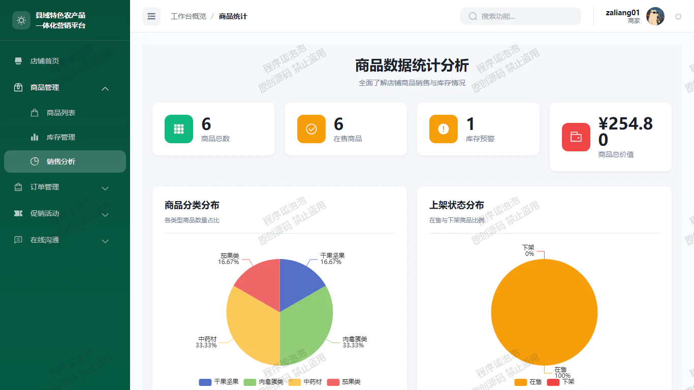
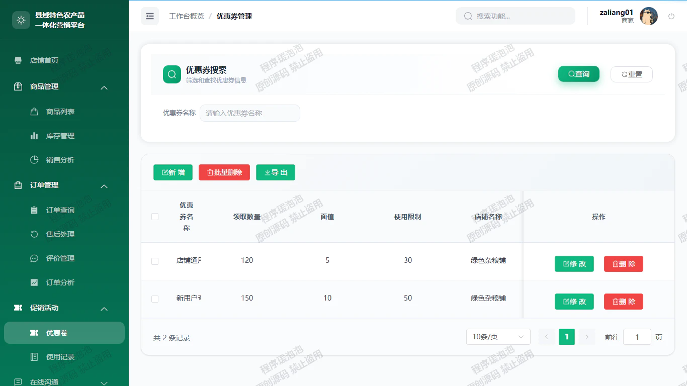
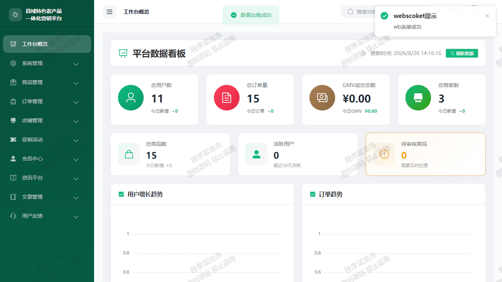
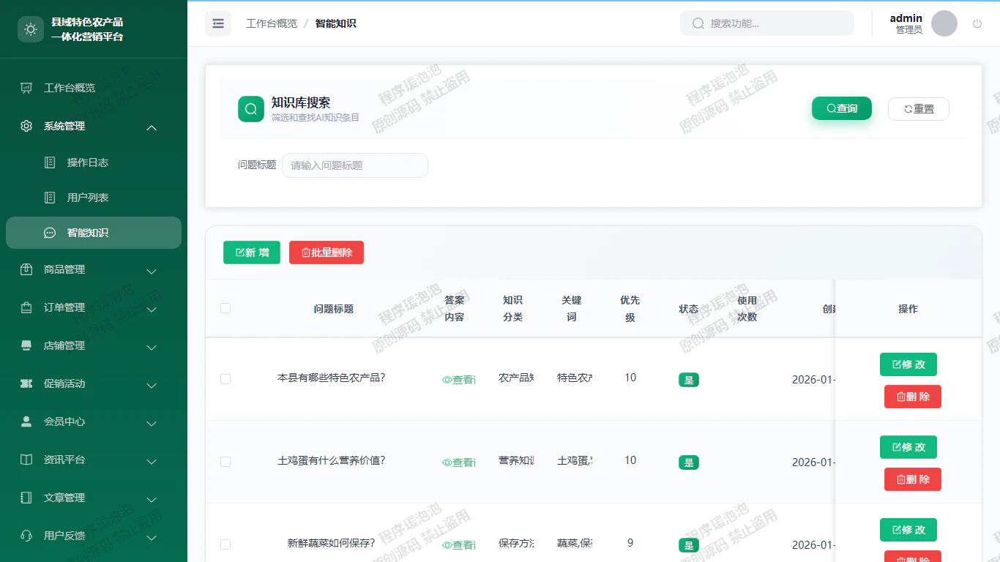
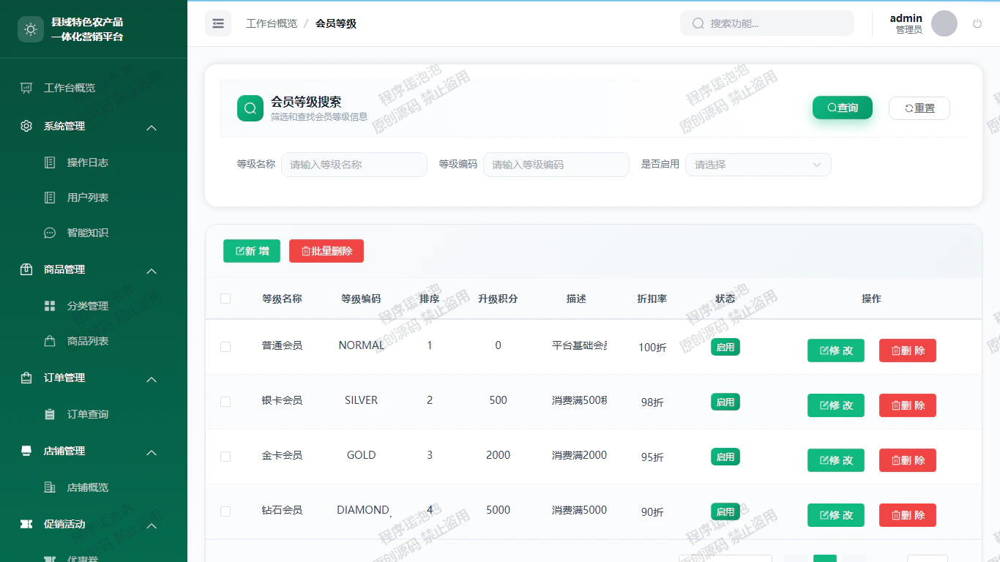

# CountyAgriculturalProducts
农产品一体化营销平台 亮点：AI智能客服、协同过滤推荐算法、Echarts图形化分析、WebSocket实时通讯、物流快递Api查询、支付宝沙箱支付、优惠券营销与会员积分体系；
所有源码均本人开发，项目是前后端分离的，所有的项目都具备了完整的业务逻辑，不仅仅局限于基础的增删改查（CRUD）操作，系统亮点众多。

本文注重于计算机毕业设计选题指导，列出题目均有源码， 大家可以去【公众号】(毕业终点站)获取或者加我【qq】(2112698948)提意见(别忘记Star哟)。备注：git

声明：仅用于学习使用，请勿用于任何商业行为！

1.系统非商用，非开源，非无偿。

2.由本人开发，如需源码，请联系以下方式，qq:2112698948。

3.项目有很多，并未全部上传，如果未找到想要的，可直接咨询。

# 🌾 农产品一体化营销平台（CountyAgriculturalProducts）

> 基于 Spring Boot + Vue3 的县域农产品一体化营销平台：AI 智能客服、协同过滤推荐、支付宝沙箱支付、物流轨迹查询、WebSocket 实时通讯、优惠券营销与会员积分体系，前后端分离，用户 / 商家 / 管理员三端完整实现。

## 📖 项目简介

本平台面向县域农产品线上营销场景，围绕"浏览 → 下单 → 支付 → 物流 → 售后"的完整购物流程展开，同时提供商家经营后台与平台管理后台：

- **用户端**：农产品浏览与搜索、购物车、下单支付、物流跟踪、售后申请、文章资讯、在线沟通、AI 助手
- **商家端**：商品与库存管理、订单处理、售后处理、优惠券营销、销售数据可视化
- **管理端**：用户 / 店铺 / 商品审核、内容管理、AI 知识库维护、会员体系、全站数据看板

## ✨ 系统亮点

| # | 亮点 | 实现方式 |
| --- | --- | --- |
| 1 | AI 智能客服 | LangChain4j 对接 DeepSeek 大模型，知识库优先匹配 + 大模型补充生成 |
| 2 | 协同过滤推荐 | 基于 Jaccard 相似系数计算用户相似度，推荐相似用户购买过的商品 |
| 3 | Echarts 图形化分析 | 商家端 / 管理端销售、订单、文章等多维度数据可视化 |
| 4 | WebSocket 实时通讯 | Spring Boot WebSocket 实现用户与商家在线沟通 |
| 5 | 物流快递 Api 查询 | 对接阿里云市场快递查询 Api，物流轨迹时间轴展示 |
| 6 | 支付宝沙箱支付 | 下单、支付、定时查单、退款全流程，答辩演示零成本 |
| 7 | 优惠券营销与会员积分 | 优惠券创建 / 领取 / 使用 + 会员等级折扣体系 |

## 🧰 技术栈

| 分类 | 技术 |
| --- | --- |
| 前端（前台 + 后台） | Vue3、Vue Router、Pinia、Vite、Element-Plus、Axios、Sass |
| 图表 / 通信 | Echarts、WebSocket |
| 后端 | Java、Spring Boot、MyBatis-Plus、JWT、LangChain4j、HanLP、WebSocket、Apache POI |
| AI 模型 | DeepSeek 大模型接口 |
| 第三方服务 | 支付宝 SDK（沙箱环境）、阿里云市场快递 Api |
| 数据库 | MySQL 5.7 / 8.0（库名：CountyAgriculturalProducts）、Navicat 12 |
| 运行环境 | Windows 10 / 11、JDK 17、Node.js |
| 开发工具 | IntelliJ IDEA 2025、Visual Studio Code |

## 🖼️ 系统截图

> 本文档仅展示 10 张核心页面。所有截图均采用**相对路径引用**，随仓库 `images/` 目录一起提交，GitHub / Gitee 均可直接渲染，不会被外链防盗链拦截。

|  |  |
| :---: | :---: |
| 用户端首页（协同过滤推荐位） | 商品详情 |
|  |  |
| AI 智能助手 | 消息会话（WebSocket 实时通讯） |
|  |  |
| 物流轨迹查询（快递 Api） | 商家端销售分析（Echarts） |
|  |  |
| 商家端优惠券管理 | 管理员工作台概览 |
|  |  |
| AI 知识库维护 | 会员等级配置 |

## 🧩 功能模块一览

| 角色 | 功能模块 |
| --- | --- |
| 用户端 | 首页、农产品大全、商品详情、店铺详情、购物车、我的订单、订单详情、物流查询、售后申请、文章资讯、文章详情、全站搜索、消息会话、AI 助手、个人中心 |
| 商家端 | 我的店铺、商品管理、库存管理、商品销售分析、订单查询、售后处理、评价管理、订单数据分析、优惠券管理、优惠券使用记录、在线沟通 |
| 管理端 | 工作台概览、用户列表、操作日志、AI 知识库、商品分类、商品列表、订单查询、店铺管理、优惠券管理、会员等级、地址管理、敏感词管理、封面广告、文章管理、文章综合统计、留言反馈 |

## 🔧 核心实现说明

### 1. AI 智能客服
集成 LangChain4j 并对接 DeepSeek 大模型。后端先通过 AI 知识库、关键词和文本相似度进行匹配，未命中时再调用大模型生成回复，实现"知识库优先 + 大模型补充"的问答模式，兼顾准确性与回复成本。

### 2. 协同过滤推荐算法
基于用户订单历史计算用户相似度，使用 Jaccard 相似系数衡量不同用户购买商品集合的相似程度，再推荐相似用户购买过而当前用户未购买的商品；推荐不足时使用热门商品补充。文章推荐则根据标题、内容、分类等信息进行内容相似度计算。

### 3. 支付宝沙箱支付
后端通过 `/OrderInfo/AliPay` 接口生成电脑网站支付表单，支付网关使用支付宝沙箱环境；系统通过定时任务调用支付宝交易查询接口检测支付状态，支付成功后将订单从待支付流转为待发货；售后退款流程中封装了支付宝退款接口，下单、支付、查询、退款全流程可演示。

### 4. 物流快递 Api 查询
前端调用 `/OrderInfo/QueryExpress` 接口并解析 `data.logisticsTraceDetailList` 物流轨迹数据；后端根据物流单号对接阿里云市场快递查询 Api，查询结果写入订单物流信息字段，减少重复调用，以时间轴方式展示配送节点。

### 5. WebSocket 实时通讯
基于 Spring Boot WebSocket 实现用户与商家之间的实时消息通信，支持会话列表、消息记录、在线收发。

### 6. Echarts 图形化分析
商家端与管理端使用 Echarts 展示平台运营统计、商品销售分析、订单数据分析、文章综合统计等数据，提供可视化决策依据。

## 🗄️ 数据库设计

系统数据库共 **32 张表**，覆盖以下模块：

| 模块 | 数据表 | 说明 |
| --- | --- | --- |
| AI 智能 | aiconversation、aiknowledge、aimessage | AI 会话、AI 知识库、AI 消息 |
| 用户管理 | sysuser、useraddress、memberlevel | 用户账号、收货地址、会员等级 |
| 店铺管理 | shop、shopcollect | 店铺信息、店铺收藏 |
| 商品管理 | good、goodtype、goodprop、goodstock、goodcollect | 商品、分类、属性、库存、收藏 |
| 订单管理 | orderinfo、orderdet、ordercomment、orderreturn | 订单、订单明细、评价、退货退款 |
| 购物车 | buycard | 用户购物车 |
| 优惠券 | coupon、couponrecord | 优惠券、领取使用记录 |
| 文章资讯 | article、articletype、articlecollect、articlelook、articleraise | 文章、分类、收藏、浏览、点赞 |
| 广告反馈 | banner、leavefeedback | 首页广告、留言反馈 |
| 即时通讯 | wechatcollection、wechatmessage | 会话列表、聊天消息 |
| 内容安全 | sensitiveword | 敏感词库 |
| 上门服务 | homeservice | 上门服务预约记录 |
| 系统管理 | operationlog | 操作日志 |

表关系以**用户、店铺、商品、订单**为核心：用户拥有收货地址、购物车、订单、收藏记录、反馈记录和 AI 会话；商家拥有店铺、商品、优惠券和订单；订单关联订单明细、评价与售后记录；文章关联分类、浏览、点赞与收藏记录。

数据库初始化文件：`CountyAgriculturalProducts.sql`

## 🚀 快速开始

### 环境要求

- JDK 17
- Node.js
- MySQL 5.7 / 8.0
- Maven（后端依赖管理）
- 开发工具：IntelliJ IDEA 2025、Visual Studio Code、Navicat 12

### 部署步骤

1. **导入数据库**：使用 Navicat 连接 MySQL，新建数据库后导入 `CountyAgriculturalProducts.sql`；
2. **启动后端**：使用 IDEA 打开后端工程，在配置文件中修改数据库连接（地址 / 账号 / 密码），启动 Spring Boot 主类；
3. **启动前端**：使用 VSCode 分别打开前台、后台工程，执行依赖安装与本地启动命令；
4. **访问系统**：前后端启动完成后，按控制台输出的地址分别访问用户端与管理端。

> 💡 提示：支付宝沙箱支付、快递查询 Api、DeepSeek 大模型等第三方服务需要自行申请相关账号 / 密钥，并按项目配置说明替换。

## 📌 说明

- 本项目仅供学习交流使用；
